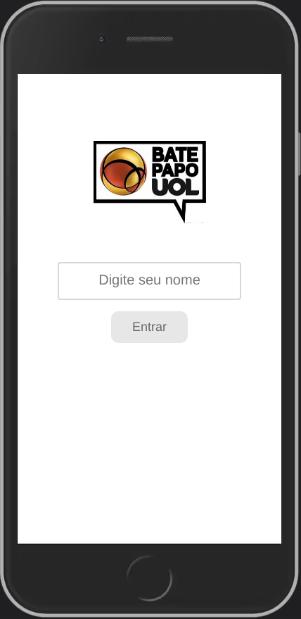
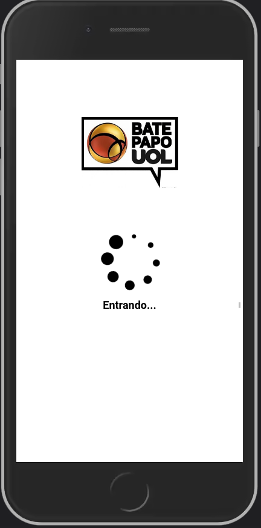
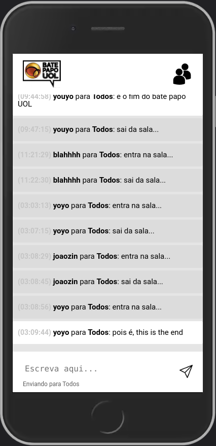
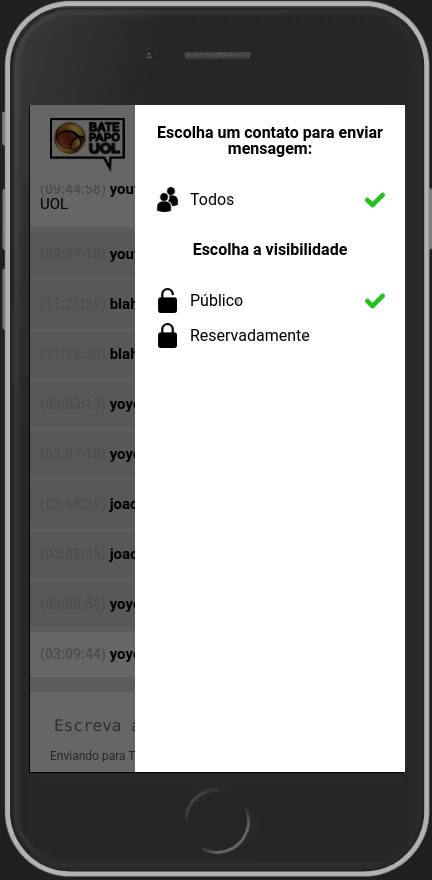

# Sobre
Esse projeto foi inspirado no antigo BatePapo da UOL, uma ferramenta simples para enviar mensagens instantâneas em uma sala de chat. Foi desenvolvido com as tecnologias puras da web: JavaScript, HTML e CSS. Sem nenhuma biblioteca ou framework. Você pode [acessar aqui](https://yoyolops.github.io/batePapoUOL/)

# Funcionamento
Depois de informar seu nickname (não é preciso fazer cadastro) você acessa a sala comum, onde todos os participantes estão. A cada 3 segundos novas mensagens são carregadas e exibidas na tela. Você pode enviar mensagens públicas ou reservadamente para usuários online específicos.

# Prints

Tela de entrada:           |  Loading:
:-------------------------:|:-------------------------:
   |    

Chat:        | Menu: 
:-------------------------:|:-------------------------:
   |   
